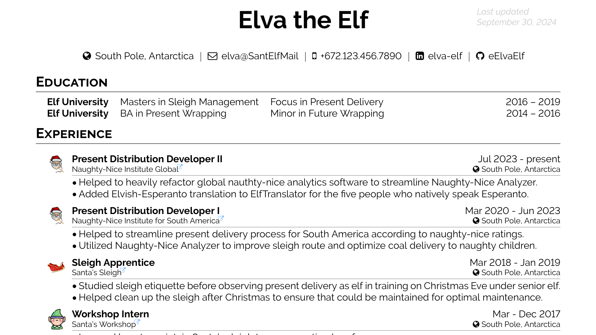

# Enĝeniero CV Template Class



Simple LaTeX CV/resumé template for engineers and elves that still retains
flexibility and doesn't get in your way.

## Usage

Copy [`engxeniero.cls`](./engxeniero.cls) into your folder.

See [resumo.tex](./resumo.tex) for a robust example, and do something like
```tex
\documentclass[10pt]{engxeniero}

\author{Your Name}

\begin{document}
\placelastupdatedtext

\begin{center}
  \name

  \vspace{15pt}
  \info
  {\faGlobe \, Your Location}
  {\href{mailto:YourEmail@email.com}{\faEnvelopeO \, YourEmail@email}}
  % etc...
  \par
\end{center}

\section{Education}

\begin{tabularx}{\linewidth}{@{}llXr@{}}
  \textbf{My University} & My Major & My Minor & 2018 – 2022 \\
  % ... etc
\end{tabularx}

\section{Experience}

\job{My Job Title}
  {\iurl{https://MyJobsFancyWebsite}{My Job's Name}}
  {myJobsLogo.png}
  {Jul 2024 - present}
  {South Pole, Antarctica} {
    \item Helped do things.
    \item Did more things.
  }
% etc ...

\section{Technologies}

\begin{tabularx}{\linewidth}{@{} >{\bfseries}r | X @{}}
  Certifications & \lurl{https://linkToCert1}{Some Cert}, \lurl{https://linkToCert2}{Another Cert} \\
  % etc ...
\end{document}
```

See [`resumo.pdf`](./resumo.pdf) for the rendered example pdf.

## Packages Used

```tex
\usepackage{geometry} \usepackage{hyperref} \usepackage{calc}
\usepackage{titlesec} \usepackage{tabularx} \usepackage{ulem}
\usepackage{multirow} \usepackage{colortbl} \usepackage{xcolor}
\usepackage{booktabs} \usepackage{graphicx} \usepackage{contour}
\usepackage{enumitem} \usepackage{moresize} \usepackage{fontawesome}
\usepackage{eso-pic}
```

## Features

- `\placelastupdatedtext` puts "Last Update:\\today" at the top-right of the
  page if you call it.
- `\name` is a command that generates the author's name in large, bold text.
  - it accepts an optional parameter to change the font size: `\name[30pt]`.
  - use `\begin{center} \name \end{center}` to center it.
- `\info` creates a bar of contact information until a `\par`
  - use `{\faGlobe \, My Location}`, for example.
  - use `{\href{mailto:myEmail@email.whatever}{myEmail@email}}` to make it a hyperlink
- `\job` creates a job that has the title and dates at the top, the company name
  and location just below, the company's logo to the left of these two headers
  lines, and puts the experience items in a list below.
  - it has 6 params: `\job{Workshop Assistant}{Santa's Workshop}{Jan 2023 - Jun 2024}{North Pole}{ \item Wrapped presents. \item Fetched coffee.}`
- `engxiniero.cls` also sets up page margings, header spacing, etc to maximize
  space so you can fit all of your experience on one page.

Otherwise, it's up to you how to format things. See [resumo.tex](./resumo.tex)
for inspiration. Good luck job hunting. ♥

